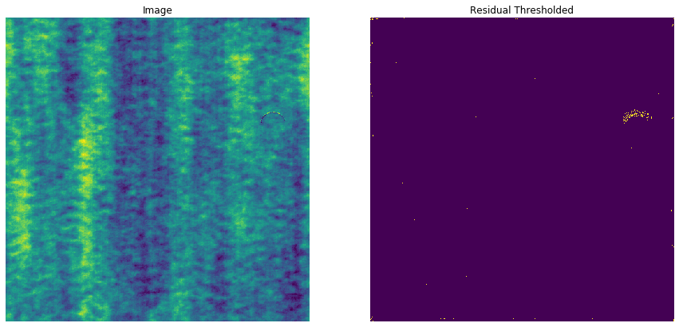

This is the implementation of [Semi-supervised Anomaly Detection using AutoEncoders](https://arxiv.org/abs/2001.03674 "Semi-supervised Anomaly Detection using AutoEncoders")

The hypothesis of the paper is that an AutoEncoder trained on just the defect free or normal samples will fail to reconstruct the images that have defects in it since those were not seen during training. This will lead to large residuals which can be then be used to segment the anomaly.

For this repository the dataset needs to be organised as:
```
TrainDir
----NonDefect
    |----Img1
	|    ...
    |----ImgM
ValDir
----NonDefect
    |----Img1
	|	...
    |----ImgN
```

Usage:
```bash
python main.py --train_dir /path/to/train/dir/ --val_dir /path/to/val/dir
```

```
Requirements:
PyTorch >= 1.4
Ignite 0.3.0
Tensorboard 2.1.0
```

An example segmentation output of AutoEncoder trained on the [DAGM dataset](https://hci.iwr.uni-heidelberg.de/content/weakly-supervised-learning-industrial-optical-inspection "DAGM dataset") is shown below. The model was trained on the Class8 and trained for 25 epochs. The best model was kept based on the lowest mean squared error value.


